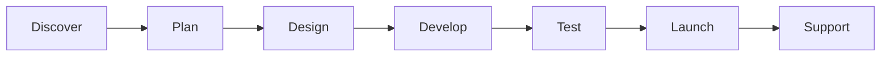
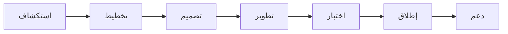

# ملخص تنفيذي

هذا التقرير يقدم **خطة شاملة وعملية** لإعادة صياغة محتوى موقع Aivora باللغتين الإنجليزية والعربية. يركز التقرير على تحويل لغة الموقع من أسلوب تقني هندسي إلى لغة تركز على القيمة المضافة للعملاء ونمو أعمالهم مع الحفاظ على هوية الشركة التقنية المتميزة. يضم التقرير:

- جدول **الاستبدال النصي** الكامل (Original → Replacement) لكل نص في الموقع (بالإنجليزية والعربية).  
- قائمة تنفيذية (Execution Checklist) قابلة للتنفيذ خطوة بخطوة لوكيل Antigravity لتطبيق التعديلات.  
- قائمة البيانات الوهمية (Fake/Demo) التي يجب إزالتها أو استبدالها مع مقترحات بديلة.  
- **الصفحات الجديدة والمسارات المقترحة** (Work/Portfolio, خدمات مفصلة، About, مدونة، Careers، Privacy، Terms، Case Studies، Process) مع معرّفات SEO (meta titles/descriptions) وإنشاء جدول لها.  
- **خطة SEO**: عناوين ميتا، وشرح، وكلمات مفتاحية (EN + AR)، وأمثلة على بيانات JSON-LD المنظمة (Organization, Service, FAQ).  
- نصوص كاملة للصفحات الجديدة بالإنجليزية والعربية (حولنا، الخدمات، المدونة، المحافظ، الخ).  
- حقول النموذج النصية (field labels)، ونصوص المساعدة (helper texts) ونموذج استكشاف المشروع Project Discovery Form.  
- قائمة CTA المقترحة (CTA رئيسي واحد، وتنوعات ثانوية) بالعربية والإنجليزية.  
- محتوى لقسم الفريق (Team) وثقة العملاء (Trust)، واقتراحات للـsocial proof البديلة.  
- ملاحظات تنفيذية: أين يتم تطبيق الاستبدالات في الكود (مع تحديد “غير محدد” إذا لزم الأمر)، وقائمة أولويات التعديل، وقائمة مراجعة (QA checklist) للقبول النهائي.  
- مخطط سير العمل (Process) برمجي باستخدام Mermaid.  
- عناصر بصرية مقترحة (Open Graph image text ونصوص توضيحية Mockup Captions).  

**معايير القبول النهائية**: يجب أن يصبح الموقع بعد التنفيذ **احترافيًا، مركزًا على العميل، سهل القراءة، موثوقًا، وموجهًا للتحويل**؛ محتوى بالإنجليزية والعربية يعكس قيمة الأعمال بدقة، مع تحسين SEO شامل.

---

# 1. جدول الاستبدال النصي (Mapping Table)

نقدم جدولًا شاملًا لكل النصوص الحالية في الموقع مع النص المقترح بالإنجليزية والعربية. الجدول التالي يجمع **النص الأصلي (إنجليزي)** إلى **النص البديل (إنجليزي)** و**النص البديل (عربي)**.  
(ملاحظة: بالنسبة للمحتوى الأصلي العربي غير الموجود أو غير مكتمل، نركز على توفير النسخ العربية الجديدة.)

| الموقع/القسم                     | النص الأصلي (EN)                                                | نص مقترح (EN)                                                                                                                                               | نص مقترح (AR)                                                                                                                                                  |
|----------------------------------|-----------------------------------------------------------------|-------------------------------------------------------------------------------------------------------------------------------------------------------------|------------------------------------------------------------------------------------------------------------------------------------------------------------------|
| **الهيدر - عنوان الصفحة الرئيسية**    | *We build AI systems that run without compromise.*             | *We build AI-powered software that helps ambitious businesses grow faster, automate operations, and scale with confidence.*                                  | **نبني حلولًا برمجية مدعومة بالذكاء الاصطناعي تساعد الشركات الطموحة على النمو، وأتمتة العمليات، والتوسع بثقة.**                                                      |
| **الهيدر - وصف مختصر**            | *Aivora is a premium AI engineering studio. We build deterministic agentic workflows, high-throughput backend services, and secure enterprise software for ambitious teams.* | *Aivora is an AI software engineering company that designs, builds, and scales modern digital products for startups and businesses. From AI solutions and SaaS platforms to enterprise systems, we turn ideas into production-ready software.* | **أيفورا شركة متخصصة في هندسة البرمجيات والذكاء الاصطناعي، نقوم بتصميم وتطوير وتوسيع المنتجات الرقمية الحديثة للشركات والجهات الطموحة، بدءًا من حلول الذكاء الاصطناعي ومنصات SaaS وحتى الأنظمة المؤسسية المتكاملة.** |
| **الهيدر - زر CTA 1**           | *Start a Project*                                               | *Start a Project*                                                                                                                                           | **ابدأ مشروعك**                                                                                                                                                   |
| **الهيدر - زر CTA 2**           | *Explore Case Studies*                                         | *View Our Work*                                                                                                                                             | **شاهد أعمالنا**                                                                                                                                                 |
| **قسم المنتجات (Product Showcase) - عنوان القسم** | *Engineering the Future of SaaS*                               | *Products We Build*                                                                                                                                         | **المنتجات التي نبنيها**                                                                                                                                            |
| **قسم المنتجات - الوصف**        | *Discover the high-throughput systems we build for our partners.* | *Explore real examples of digital products we design and develop for startups and businesses.*                                                              | **استكشف نماذج من المنتجات الرقمية التي نصممها ونطورها للشركات والجهات الطموحة.**                                                                                      |
| **بطاقة: AI Business Assistant** | *An autonomous agentic interface that connects your business data with advanced language models to resolve customer queries and automate internal workflows.* | *An AI assistant that helps businesses automate customer support, internal operations, and repetitive workflows.*                                            | **مساعد ذكي يساعد الشركات على أتمتة خدمة العملاء والعمليات الداخلية والمهام المتكررة.**                                                                              |
| **بطاقة: CRM Platform**         | *A high-performance customer relationship management system engineered with strict data isolation and real-time state synchronization.* | *A custom CRM platform designed around your business instead of forcing your business to adapt to generic software.*                                        | **منصة CRM مخصصة يتم تصميمها بما يناسب طبيعة عملك بدلاً من إجبارك على استخدام حلول جاهزة.**                                                                           |
| **عنوان قسم القدرات (MORE CAPABILITIES)** | *MORE CAPABILITIES*                                          | *What We Can Build*                                                                                                                                         | **ما الذي يمكننا بناؤه؟**                                                                                                                                            |
| **وصف: Business Automation**     | *Event-driven background processing pipelines that execute deterministic logic across integrated third-party APIs.* | *Automation systems that remove manual work and connect your tools into one efficient workflow.*                                                            | **أنظمة أتمتة تقلل العمل اليدوي وتربط أدواتك في سير عمل واحد أكثر كفاءة.**                                                                                           |
| **وصف: Analytics Dashboard**    | *Real-time telemetry and data visualization interfaces optimized for massive dataset rendering without main-thread blocking.* | *Dashboards that turn your data into clear insights your team can use to make faster decisions.*                                                            | **لوحات تحكم تحول بياناتك إلى رؤى واضحة تساعد فريقك على اتخاذ قرارات أسرع.**                                                                                        |
| **وصف: Client Portal**         | *Secure, multi-tenant portals designed to provide your customers with seamless access to their data and services.* | *Secure client portals that give your customers simple, reliable access to their data and services.*                                                          | **بوابات عملاء آمنة تمنح عملاءك وصولًا سهلاً وموثوقًا إلى بياناتهم وخدماتهم.**                                                                                       |
| **وصف: Workflow Builder**      | *Visual, node-based workflow engines that empower your team to design and deploy complex business logic without writing code.* | *Workflow tools that help your team design and launch business processes with less manual effort.*                                                          | **أدوات لإدارة سير العمل تساعد فريقك على تصميم وتشغيل العمليات التجارية بأقل جهد يدوي.**                                                                              |
| **وصف: Custom Enterprise Software** | *Bespoke architectural solutions engineered from the ground up to solve your most complex operational bottlenecks.* | *Custom software built from the ground up to solve the specific challenges your business faces.*                                                             | **برمجيات مخصصة تُبنى من الصفر لحل التحديات الخاصة التي تواجه عملك.**                                                                                                  |
| **قسم قدرات الاستوديو - العنوان**  | *STUDIO CAPABILITIES<br>Engineering Solutions Designed for Growth* | *STUDIO CAPABILITIES<br>Solutions Built for Real Business Growth*                                                                                           | **قدرات الأستوديو<br>حلول مصممة للنمو الحقيقي**                                                                                                                     |
| **قسم قدرات الاستوديو - وصف المقدمة** | *An integrated suite of technical services built to solve complex business challenges.* | *A focused set of services designed to help businesses launch, automate, and scale with confidence.*                                                      | **مجموعة خدمات متكاملة تساعد الشركات على الإطلاق، والأتمتة، والتوسع بثقة.**                                                                                              |
| **خدمة: Enterprise AI Engineering - العنوان الفرعي** | *Enterprise AI Engineering*                                    | *Enterprise AI Engineering* (يُترك كما هو كاسم)                                                                                                           | **هندسة الذكاء الاصطناعي للمؤسسات**                                                                                                                                |
| **وصف الخدمة (AI)**           | *Custom LLM integrations and autonomous agents engineered to give your business an unfair advantage.* | *Custom AI solutions that improve customer experience, automate tasks, and support better decision-making.*                                                | **حلول ذكاء اصطناعي مخصصة تحسن تجربة العملاء، وتؤتمت المهام، وتدعم اتخاذ القرار.**                                                                                      |
| **مشكلة (AI)**               | *Manual workflows bottleneck growth, and legacy software cannot adapt to unstructured data.* | *Manual work slows down growth, and outdated systems cannot keep up with modern business needs.*                                                            | **العمل اليدوي يبطئ النمو، والأنظمة القديمة لا تواكب احتياجات الأعمال الحديثة.**                                                                                       |
| **حل (AI)**                  | *We architect secure, scalable AI systems that directly interface with your core business logic.* | *We build secure, scalable AI systems that fit naturally into your business operations.*                                                                  | **نبني أنظمة ذكاء اصطناعي آمنة وقابلة للتوسع تتكامل بسلاسة مع عملياتك التشغيلية.**                                                                                      |
| **نتيجة العمل (AI)**         | *Reduce operational overhead, unlock new revenue streams, and automate complex decision-making.* | *Cut operational overhead, increase efficiency, and create new opportunities for growth.*                                                                 | **خفض التكاليف التشغيلية، وزيادة الكفاءة، وفتح فرص جديدة للنمو.**                                                                                                     |
| **خدمة: Custom Platform Engineering - العنوان الفرعي** | *Custom Platform Engineering*                                 | *Custom Platform Engineering* (يُترك كما هو)                                                                                                               | **هندسة المنصات المخصصة**                                                                                                                                            |
| **وصف الخدمة (Platform)**     | *Modern web applications and SaaS platforms built to validate ideas and dominate markets.* | *Modern websites and SaaS platforms built to help you launch faster and compete with confidence.*                                                         | **مواقع ويب ومنصات SaaS عصرية تساعدك على الإطلاق بسرعة والمنافسة بثقة.**                                                                                              |
| **مشكلة (Platform)**          | *Off-the-shelf software limits your unique business processes and competitive edge.* | *Generic software often fails to match the way your business actually works.*                                                                             | **البرمجيات الجاهزة غالبًا لا تناسب الطريقة الفعلية التي يعمل بها نشاطك.**                                                                                               |
| **حل (Platform)**             | *We build high-performance, tailored platforms designed specifically for your exact operational needs.* | *We design tailored platforms that match your exact business requirements.*                                                                              | **نصمم منصات مخصصة تتوافق مع احتياجاتك التشغيلية الدقيقة.**                                                                                                           |
| **نتيجة العمل (Platform)**    | *Complete ownership of IP, pixel-perfect UX, and uncompromised technical performance.* | *Full ownership of your product, a polished user experience, and reliable technical performance.*                                                         | **ملكية كاملة للمنتج، وتجربة مستخدم متقنة، وأداء تقني موثوق.**                                                                                                         |
| **خدمة: Data & Systems Integration - العنوان الفرعي** | *Data & Systems Integration*                                | *Data & Systems Integration* (يُترك كما هو)                                                                                                               | **تكامل البيانات والأنظمة**                                                                                                                                          |
| **وصف الخدمة (Integration)**  | *Stateless automation pipelines and data synchronization hooks that replace manual work loops.* | *Integration systems that connect your tools, synchronize your data, and reduce repetitive work.*                                                        | **أنظمة تكامل تربط أدواتك وتزامن بياناتك وتقلل الأعمال المتكررة.**                                                                                                   |
| **مشكلة (Integration)**       | *Siloed data and disconnected tools cause critical information gaps and operational drag.* | *Disconnected tools and scattered data create delays and gaps in operations.*                                                                             | **الأدوات غير المتصلة والبيانات المبعثرة تسبب تأخيرًا وفجوات في العمليات.**                                                                                         |
| **حل (Integration)**          | *We engineer robust middleware and event-driven architectures to unify your digital ecosystem.* | *We build reliable integration layers that bring your systems together into one connected environment.*                                                 | **نبني طبقات تكامل موثوقة توحد أنظمتك داخل بيئة رقمية واحدة مترابطة.**                                                                                               |
| **نتيجة العمل (Integration)** | *Real-time data accuracy, eliminated redundant data entry, and seamless cross-platform sync.* | *More accurate data, less manual entry, and smoother cross-platform operations.*                                                                          | **دقة أعلى في البيانات، إدخال يدوي أقل، وتشغيل أكثر سلاسة عبر المنصات.**                                                                                             |
| **خدمة: Cloud Architecture & Scaling - العنوان الفرعي** | *Cloud Architecture & Scaling*                            | *Cloud Architecture & Scaling* (يُترك كما هو)                                                                                                              | **البنية السحابية والتوسع**                                                                                                                                           |
| **وصف الخدمة (Cloud)**        | *High-performance cloud infrastructures and strategic technical consulting for enterprise growth.* | *Cloud systems and technical consulting that support growth, reliability, and long-term scale.*                                                          | **أنظمة سحابية واستشارات تقنية تدعم النمو والاعتمادية والتوسع طويل المدى.**                                                                                             |
| **مشكلة (Cloud)**             | *As traffic grows, monolithic codebases become fragile, slow, and expensive to maintain.* | *As your product grows, weak architecture can become slow, fragile, and expensive to maintain.*                                                           | **مع نمو المنتج، قد تصبح البنية الضعيفة بطيئة وهشة ومكلفة في الصيانة.**                                                                                                |
| **حل (Cloud)**                | *We migrate and refactor systems into resilient, serverless, or microservices architectures.* | *We refactor and modernize systems into more resilient and scalable architectures.*                                                                      | **نقوم بإعادة هيكلة وتحديث الأنظمة لتصبح أكثر مرونة وقابلية للتوسع.**                                                                                                 |
| **نتيجة العمل (Cloud)**       | *Infinite horizontal scalability, 99.99% uptime, and significantly lower cloud infrastructure costs.* | *Better scalability, higher reliability, and lower infrastructure cost over time.*                                                                     | **قابلية توسع أفضل، واعتمادية أعلى، وتكلفة تشغيل أقل على المدى الطويل.**                                                                                             |
| **قسم المجالات (Industries) - العنوان** | *INDUSTRIES WE SERVE<br>Deep expertise across diverse industries* | *INDUSTRIES WE SERVE<br>Solutions Adapted to Different Business Sectors*                                                                                    | **المجالات التي نخدمها<br>حلول مناسبة لقطاعات مختلفة**                                                                                                               |
| **قسم المجالات - المقدمة**     | *We construct custom software tailored to the operational demands and regulatory environments of key industries.* | *We build custom software tailored to the real needs of each industry we work with.*                                                                    | **نبني برمجيات مخصصة تلائم الاحتياجات الحقيقية لكل قطاع نعمل معه.**                                                                                                 |
| **التصنيفات الصناعية**         | *Healthcare, Education, Retail, Manufacturing, Startups, Real Estate* | *Healthcare, Education, Retail & Commerce, Manufacturing, Startups, Real Estate*                                                                           | **الرعاية الصحية، التعليم والتدريب، التجارة والتجزئة، التصنيع، الشركات الناشئة، العقارات**                                                                            |
| **قسم لماذا تختارنا - العنوان** | *WHY CHOOSE AIVORA<br>Engineered for high performance and reliability* | *WHY CHOOSE AIVORA<br>Built to Deliver Business Value*                                                                                                   | **لماذا أيفورا؟<br>مصممون لتحقيق قيمة حقيقية**                                                                                                                      |
| **قسم لماذا تختارنا - المقدمة** | *We integrate elite visual design with solid software engineering principles to deliver software that scales.* | *We combine premium design with strong engineering to create products that look good, work well, and scale reliably.*                                     | **نجمع بين التصميم المتميز والهندسة القوية لصناعة منتجات جميلة، فعالة، وقابلة للتوسع بثبات.**                                                                              |
| **ميزة: 100% Custom Solutions** | *We don't use templates. Every line of code is tailored to match your specific business goals and optimize performance.* | *We build custom solutions from scratch to fit your exact business goals.*                                                                                 | **نبني حلولاً مخصصة من الصفر لتناسب أهدافك بدقة.**                                                                                                                 |
| **ميزة: Rapid Delivery Cycles** | *Agile sprints coupled with automated quality gates ensure your digital product is deployed cleanly and ahead of schedule.* | *We work in focused delivery cycles to launch products efficiently and with quality.*                                                                     | **نعمل بدورات تسليم مركزة لإطلاق المنتجات بكفاءة وجودة عالية.**                                                                                                       |
| **ميزة: Premium UX & Design** | *Fluid motion design combined with modern visual layouts ensures your clients experience a premium, memorable journey.* | *We design polished user experiences that feel modern, clear, and memorable.*                                                                             | **نصمم تجارب مستخدم راقية وعصرية وواضحة تترك انطباعًا قويًا.**                                                                                                      |
| **ميزة: Long-Term Technical Support** | *We align with your product roadmap, offering continuous maintenance, security updates, and scalability optimizations.* | *We support your product beyond launch with maintenance, updates, and continuous improvement.*                                                              | **ندعم منتجك بعد الإطلاق من خلال الصيانة والتحديثات والتحسين المستمر.**                                                                                               |
| **ميزة: Scalable Architecture** | *Engineered with modern containerized microservices and highly optimized database backends designed to support high load.* | *We build systems that stay reliable as your product grows and demand increases.*                                                                            | **نبني أنظمة تظل موثوقة مع نمو منتجك وزيادة الطلب.**                                                                                                                |
| **ميزة: AI-First Development** | *We embed autonomous agents and intelligent workflows directly into your platform to optimize productivity.* | *We integrate AI where it creates practical value, automation, and efficiency.*                                                                            | **ندمج الذكاء الاصطناعي عندما يضيف قيمة عملية، وأتمتة، وكفاءة أعلى.**                                                                                              |
| **قسم "كيف نعمل" - العنوان**   | *HOW WE WORK<br>How We Work<br>From initial discovery to a verified launch.* | *HOW WE WORK<br>Our Process<br>From discovery to launch and support.*                                                                                       | **خطوات العمل<br>كيف نعمل؟<br>من الفهم إلى الإطلاق والدعم.**                                                                                                        |
| **خطوة 01 - Discover**        | *We analyze your requirements, business challenges, and long-term goals.* | *We understand your goals, challenges, and product requirements.*                                                                                          | **نستوعب أهدافك، وتحدياتك، ومتطلبات منتجك.**                                                                                                                        |
| **خطوة 02 - Plan**            | *We architect the system design and define the implementation roadmap.* | *We define the product plan, technical structure, and delivery roadmap.*                                                                                     | **نحدد خطة المنتج، والبنية التقنية، وخريطة التنفيذ.**                                                                                                                  |
| **خطوة 03 - Design**          | *We construct premium UX flows and modern visual layouts.*    | *We create clear, premium, and conversion-focused user experiences.*                                                                                        | **نصمم تجارب استخدام واضحة وراقية وموجهة للتحويل.**                                                                                                                |
| **خطوة 04 - Develop**         | *We write clean, secure, and fully typed code.*             | *We build clean, secure, and maintainable software.*                                                                                                        | **نطور برمجيات نظيفة وآمنة وسهلة الصيانة.**                                                                                                                         |
| **خطوة 05 - Launch**          | *We deploy your platform with verified performance gates.* | *We launch your product with quality checks and performance validation.*                                                                                    | **نطلق منتجك بعد مراجعات جودة واختبارات أداء.**                                                                                                                   |
| **خطوة 06 - Support**         | *Continuous monitoring and long-term optimization loops.*   | *We provide ongoing support, monitoring, and product improvements.*                                                                                         | **نقدم دعماً مستمراً ومراقبة وتحسينات طويلة المدى.**                                                                                                               |
| **قسم "فريقنا" - العنوان**    | *MEET THE TEAM<br>Engineers & designers focused on your growth* | *MEET THE TEAM<br>A Team Focused on Building and Growing Products*                                                                                           | **فريق أيفورا<br>فريق يركز على بناء المنتجات ونموها**                                                                                                               |
| **قسم "فريقنا" - المقدمة**     | *We collaborate as a focused engineering studio to build premium digital products.* | *We work as one product team to design, build, and improve digital products that create value.*                                                            | **نعمل كفريق واحد لتصميم وبناء وتحسين منتجات رقمية تحقق قيمة حقيقية.**                                                                                              |
| **دور: AI Product Architect**  | *AI Product Architect*                                       | *Product Strategist*                                                                                                                                        | **استراتيجي منتج**                                                                                                                                                  |
| **دور: Senior Software Engineer** | *Senior Software Engineer*                                  | *Software Engineer*                                                                                                                                         | **مهندس برمجيات**                                                                                                                                                   |
| **دور: Lead UI/UX Designer**   | *Lead UI/UX Designer*                                       | *UI/UX Designer*                                                                                                                                           | **مصمم واجهات وتجربة مستخدم**                                                                                                                                       |
| **دور: Backend & Cloud Engineer** | *Backend & Cloud Engineer*                                 | *Backend Engineer*                                                                                                                                            | **مهندس خلفية**                                                                                                                                                     |
| **قسم التقنيات - العنوان**    | *BUILT WITH MODERN TECHNOLOGIES<br>We build with stress-tested, modern tools* | *BUILT WITH MODERN TECHNOLOGIES<br>Modern Tools for Reliable Products*                                                                                        | **بنيتنا البرمجية<br>تقنيات حديثة لمنتجات موثوقة**                                                                                                                |
| **قسم التقنيات - الوصف**      | *Leveraging state-of-the-art frameworks to deliver secure, responsive, and ultra-fast applications.* | *Using proven modern technologies to build secure, fast, and scalable applications.*                                                                         | **نعتمد على تقنيات حديثة ومجربة لبناء تطبيقات آمنة وسريعة وقابلة للتوسع.**                                                                                         |
| **تقنيات (قائمة)**            | *Next.js, React, FastAPI, Supabase, TypeScript, OpenAI, Tailwind CSS* | *(غير متغير)*                                                                                                                                                | *(غير متغير)*                                                                                                                                                       |
| **قسم الأسئلة الشائعة - العنوان** | *COMMON QUESTIONS<br>Answers to your queries*               | *COMMON QUESTIONS<br>Frequently Asked Questions*                                                                                                             | **الأسئلة الشائعة<br>إجابات على استفساراتك**                                                                                                                       |
| **سؤال 1 (FAQ)**               | *What is Aivora's typical project timeline?*                | *How long does a typical project take?*                                                                                                                     | **ما هي المدة الزمنية المعتادة للمشروع؟**                                                                                                                         |
| **سؤال 2 (FAQ)**               | *Do you offer post-launch support?*                         | *Do you provide support after launch?*                                                                                                                     | **هل تقدمون دعماً بعد الإطلاق؟**                                                                                                                                  |
| **سؤال 3 (FAQ)**               | *Can you integrate with our existing databases?*           | *Can you connect with our existing systems and databases?*                                                                                                   | **هل يمكنكم الربط مع الأنظمة وقواعد البيانات الحالية؟**                                                                                                          |
| **قسم الاتصال - العنوان**    | *LET'S TALK<br>Have an idea? Let's build it together.*       | *LET'S TALK<br>Have an idea? Let’s turn it into a real product.*                                                                                            | **تواصل معنا<br>هل لديك فكرة؟ لنحوّلها إلى منتج حقيقي.**                                                                                                         |
| **قسم الاتصال - المقدمة**     | *Aivora helps startups, founders, and businesses transform ambitious ideas into scalable, high-performance digital products.* | *Aivora helps startups, founders, and businesses turn ambitious ideas into scalable digital products.*                                                     | **تساعد أيفورا الشركات الناشئة والمؤسسين والشركات على تحويل الأفكار الطموحة إلى منتجات رقمية قابلة للتوسع.**                                                                |
| **الاتصال المباشر - عنوان**    | *DIRECT CONNECTION*                                         | *Direct Contact*                                                                                                                                          | **اتصال مباشر**                                                                                                                                                    |
| **اتصال إنستجرام (وصف)**       | *Scan or click to connect on Instagram*                     | *Scan or click to connect with us on Instagram*                                                                                                            | **امسح الرمز أو اضغط للتواصل معنا عبر إنستجرام**                                                                                                              |
| **نصوص مساعدة النموذج**         | *Typically respond in under 24 hours*<br>*Free initial consultation*<br>*All data is secure and confidential* | *Usually respond within 24 hours*<br>*Free initial consultation*<br>*Your data is handled securely and confidentially*                                             | **عادةً نرد خلال 24 ساعة**<br>**استشارة أولية مجانية**<br>**جميع البيانات آمنة وسرية**                                                                                   |
| **حقول النموذج (EN)**          | *FULL NAME* / *COMPANY NAME* / *EMAIL ADDRESS* / *PHONE NUMBER (OPTIONAL)* / *PROJECT TYPE* / *ESTIMATED BUDGET* / *MESSAGE / PROJECT DETAILS* / *SUBMIT PROPOSAL* | *Full Name* / *Company Name* / *Email Address* / *Phone Number (Optional)* / *Project Type* / *Estimated Budget* / *Project Details* / *Submit* | **الاسم الكامل** / **اسم الشركة** / **البريد الإلكتروني** / **رقم الهاتف (اختياري)** / **نوع المشروع** / **الميزانية التقديرية** / **تفاصيل المشروع** / **إرسال** |
| **خيارات القائمة المنسدلة**   | *Select project type...*<br>*Select budget range...*        | *Choose a project type...*<br>*Choose a budget range...*                                                                                                    | **اختر نوع المشروع...**<br>**اختر نطاق الميزانية...**                                                                                                             |
| **تذييل الصفحة - الوصف**       | *Deterministic AI systems and enterprise software engineered for high-throughput environments.* | *AI-powered software and enterprise systems built for growth, reliability, and scale.*                                                                    | **برمجيات مدعومة بالذكاء الاصطناعي وأنظمة مؤسسية مصممة للنمو والاعتمادية والتوسع.**                                                                                      |
| **روابط التذييل**             | *Capabilities, Company, Newsletter*                         | *(لا تغيير)*                                                                                                                                                | **القدرات، الشركة، النشرة البريدية**                                                                                                                             |
| **روابط الشركة (Footer)**      | *About Us, Capabilities, Engineering Blog, Contact*        | *About Us, Capabilities, Blog, Contact*                                                                                                                   | **من نحن، القدرات، المدونة، تواصل معنا**                                                                                                                           |
| **النشرة البريدية**           | *Subscribe to our engineering newsletter for deep technical insights.* | *Subscribe to get practical updates about products, design, and software development.*                                                                    | **اشترك للحصول على تحديثات عملية حول المنتجات، والتصميم، وتطوير البرمجيات.**                                                                                       |
| **حقوق الطبع والنشر**         | *© 2026 Aivora. All rights reserved.*                       | *(لا تغيير على الإنجليزية)*                                                                                                                               | **© 2026 Aivora. جميع الحقوق محفوظة.**                                                                                                                           |
| **صفحات الخطأ 404/500 (العنوان)** | *404 Not Found* / *500 Internal Server Error*            | *404 - Page Not Found* / *500 - Internal Server Error*                                                                                                   | **404 - الصفحة غير موجودة** / **500 - خطأ في الخادم**                                                                                                              |
| **صفحات الخطأ (وصف)**         | *The page you are looking for might have been removed...* (placeholder) | *We couldn't find that page. Try using the menu or contact us if you need help.*                                                                            | **الصفحة المطلوبة غير موجودة. استخدم القائمة أو اتصل بنا للمساعدة.**                                                                                                |
| **Alt text مقترح (general)**  | *Desktop screenshot of Aivora App UI / Dashboard*          | *Screenshot of a smooth Aivora dashboard interface / Example analytics panel*                                                                             | **صورة لشاشة تطبيق واجهة أندرويد/ سطح المكتب من Aivora**                                                                                                             |

> **ملاحظة:** النصوص الأصلية غير الإنجليزية (مثل الترجمة العربية الحالية) قد يتم تجاهلها لصياغة بديلة أعلى جودة. الجدول أعلاه يحتوي على الاستبدالات النهائية مع نص عربي جديد يتماشى مع قواعد الجودة (Transcreation).

---

# 2. قائمة تنفيذية (Execution Checklist)

قائمة مفصلة من أوامر التطبيق التي يمكن لوكيل Antigravity تنفيذها خطًا بخط:

1. **الهيدر - العناوين والزرار:**  
   - استبدال نص العنصر `"We build AI systems that run without compromise."` بـ `"We build AI-powered software that helps ambitious businesses grow faster, automate operations, and scale with confidence."`.  
   - استبدال نص العنصر `"Aivora is a premium AI engineering studio. We build deterministic agentic workflows, high-throughput backend services, and secure enterprise software for ambitious teams."` بـ `"Aivora is an AI software engineering company that designs, builds, and scales modern digital products for startups and businesses. From AI solutions and SaaS platforms to enterprise systems, we turn ideas into production-ready software."`.  
   - استبدال نص الزر `"Start a Project"` بـ `"Start a Project"` (دون تغيير نص إنجليزي) وترجمته إلى العربية `"ابدأ مشروعك"`.  
   - استبدال نص الزر `"Explore Case Studies"` بـ `"View Our Work"`. وترجمته إلى `"شاهد أعمالنا"`.  

2. **قسم المنتجات (Product Showcase):**  
   - استبدال عنوان القسم `"Engineering the Future of SaaS"` بـ `"Products We Build"`. **AR:** `"المنتجات التي نبنيها"`.  
   - استبدال الوصف `"Discover the high-throughput systems we build for our partners."` بـ `"Explore real examples of digital products we design and develop for startups and businesses."`. **AR:** `"استكشف نماذج من المنتجات الرقمية التي نصممها ونطورها للشركات والجهات الطموحة."`.  
   - استبدال نص بطاقة الـ**AI Assistant** بجملة جديدة `"An AI assistant that helps businesses automate customer support, internal operations, and repetitive workflows."`. **AR:** `"مساعد ذكي يساعد الشركات على أتمتة خدمة العملاء والعمليات الداخلية والمهام المتكررة."`.  
   - استبدال نص بطاقة الـ**CRM Platform** بجملة `"A custom CRM platform designed around your business instead of forcing your business to adapt to generic software."`. **AR:** `"منصة CRM مخصصة يتم تصميمها بما يناسب طبيعة عملك بدلاً من إجبارك على استخدام حلول جاهزة."`.  
   - استبدال عنوان قدرات المزيد `"MORE CAPABILITIES"` بـ `"What We Can Build"`. **AR:** `"ما الذي يمكننا بناؤه؟"`.  
   - لكل قسم خدمة في "What We Can Build"، استبدال النصوص القديمة بالنصوص الجديدة كما في جدول Mapping أعلاه (Business Automation, Analytics Dashboard, Client Portal, Workflow Builder, Custom Enterprise Software).  

3. **قسم قدرات الأستوديو (Studio Capabilities):**  
   - استبدال عنوان القسم `"STUDIO CAPABILITIES<br>Engineering Solutions Designed for Growth"` بـ `"STUDIO CAPABILITIES<br>Solutions Built for Real Business Growth"`. **AR:** `"قدرات الأستوديو<br>حلول مصممة للنمو الحقيقي"`.  
   - استبدال نص المقدمة `"An integrated suite of technical services built to solve complex business challenges."` بـ `"A focused set of services designed to help businesses launch, automate, and scale with confidence."`. **AR:** `"مجموعة خدمات متكاملة تساعد الشركات على الإطلاق، والأتمتة، والتوسع بثقة."`.  
   - لكل خدمة (Enterprise AI Engineering، Custom Platform Engineering، Data & Systems Integration، Cloud Architecture & Scaling)، استبدال العنوان والوصف والمشكلة والحل والنتيجة بالنصوص الجديدة من جدول الاستبدال (بالإنجليزية) وترجمتها إلى العربية وفقًا للموجود.  

4. **قسم الصناعات (Industries):**  
   - استبدال عنوان القسم `"INDUSTRIES WE SERVE<br>Deep expertise across diverse industries"` بـ `"INDUSTRIES WE SERVE<br>Solutions Adapted to Different Business Sectors"`. **AR:** `"المجالات التي نخدمها<br>حلول مناسبة لقطاعات مختلفة"`.  
   - استبدال نص المقدمة `"We construct custom software tailored to the operational demands and regulatory environments of key industries."` بـ `"We build custom software tailored to the real needs of each industry we work with."`. **AR:** `"نبني برمجيات مخصصة تلائم الاحتياجات الحقيقية لكل قطاع نعمل معه."`.  
   - استبدال تصنيفات الصناعات (إنجليزي): `"Retail"` بـ `"Retail & Commerce"`. **AR:** استخدم الصياغة الجديدة لكل تصنيف كما في جدول Mapping.  

5. **قسم لماذا تختار أيفورا (Why Choose Aivora):**  
   - استبدال عنوان القسم `"WHY CHOOSE AIVORA<br>Engineered for high performance and reliability"` بـ `"WHY CHOOSE AIVORA<br>Built to Deliver Business Value"`. **AR:** `"لماذا أيفورا؟<br>مصممون لتحقيق قيمة حقيقية"`.  
   - استبدال نص المقدمة `"We integrate elite visual design with solid software engineering principles to deliver software that scales."` بـ `"We combine premium design with strong engineering to create products that look good, work well, and scale reliably."`. **AR:** `"نجمع بين التصميم المتميز والهندسة القوية لصناعة منتجات جميلة، فعالة، وقابلة للتوسع بثبات."`.  
   - لكل ميزة من الميزات الست (100% Custom, Rapid Delivery, Premium UX, Long-Term Support, Scalable Arch, AI-First)، استبدال النص الإنجليزي بالنص الجديد وترجمته (انظر جدول Mapping).  

6. **قسم كيف نعمل (How We Work):**  
   - استبدال عنوان القسم `"HOW WE WORK<br>How We Work<br>From initial discovery to a verified launch."` بـ `"HOW WE WORK<br>Our Process<br>From discovery to launch and support."`. **AR:** `"خطوات العمل<br>كيف نعمل؟<br>من الفهم إلى الإطلاق والدعم."`.  
   - لكل خطوة (Discover, Plan, Design, Develop, Launch, Support) استبدال النص القديم بالنص الجديد (لائحة Mapping).  

7. **قسم الفريق (Team):**  
   - استبدال عنوان القسم `"MEET THE TEAM<br>Engineers & designers focused on your growth"` بـ `"MEET THE TEAM<br>A Team Focused on Building and Growing Products"`. **AR:** `"فريق أيفورا<br>فريق يركز على بناء المنتجات ونموها"`.  
   - استبدال نص المقدمة `"We collaborate as a focused engineering studio to build premium digital products."` بـ `"We work as one product team to design, build, and improve digital products that create value."`. **AR:** `"نعمل كفريق واحد لتصميم وبناء وتحسين منتجات رقمية تحقق قيمة حقيقية."`.  
   - تغيير أدوار الفريق: استبدال "AI Product Architect, Senior Software Engineer, Lead UI/UX Designer, Backend & Cloud Engineer" بأدوار جديدة (مثال: **Product Strategist, Software Engineer, UI/UX Designer, Backend Engineer**). وترجمتها. (أسماء الأدوار قد تستبدل وفق هيكلة الشركة الفعلية.)  

8. **قسم التقنيات (Technologies):**  
   - استبدال عنوان القسم `"BUILT WITH MODERN TECHNOLOGIES<br>We build with stress-tested, modern tools"` بـ `"BUILT WITH MODERN TECHNOLOGIES<br>Modern Tools for Reliable Products"`. **AR:** `"بنيتنا البرمجية<br>تقنيات حديثة لمنتجات موثوقة"`.  
   - استبدال الوصف `"Leveraging state-of-the-art frameworks to deliver secure, responsive, and ultra-fast applications."` بـ `"Using proven modern technologies to build secure, fast, and scalable applications."`. **AR:** `"نعتمد على تقنيات حديثة ومجربة لبناء تطبيقات آمنة وسريعة وقابلة للتوسع."`.  
   - أسماء التقنيات (Next.js, React, إلخ) تظل كما هي (غير تغيير).  

9. **قسم الأسئلة الشائعة (FAQ):**  
   - استبدال عنوان القسم `"COMMON QUESTIONS<br>Answers to your queries"` بـ `"COMMON QUESTIONS<br>Frequently Asked Questions"`. **AR:** `"الأسئلة الشائعة<br>إجابات على استفساراتك"`.  
   - استبدال أسئلة FAQ الثلاث بصيغ جديدة (راجع جدول Mapping).  

10. **قسم الاتصال (Contact):**  
    - استبدال عنوان القسم `"LET'S TALK<br>Have an idea? Let's build it together."` بـ `"LET'S TALK<br>Have an idea? Let’s turn it into a real product."`. **AR:** `"تواصل معنا<br>هل لديك فكرة؟ لنحوّلها إلى منتج حقيقي."`.  
    - استبدال نص المقدمة `"Aivora helps startups, founders, and businesses transform ambitious ideas into scalable, high-performance digital products."` بـ `"Aivora helps startups, founders, and businesses turn ambitious ideas into scalable digital products."`. **AR:** `"تساعد أيفورا الشركات الناشئة والمؤسسين والشركات على تحويل الأفكار الطموحة إلى منتجات رقمية قابلة للتوسع."`.  
    - استبدال عنوان الاتصال المباشر `"DIRECT CONNECTION"` بـ `"Direct Contact"`. **AR:** `"اتصال مباشر"`.  
    - تحديث نص إنستجرام `"Scan or click to connect on Instagram"` إلى `"Scan or click to connect with us on Instagram"`. **AR:** `"امسح الرمز أو اضغط للتواصل معنا عبر إنستجرام"`.  
    - استبدال نصوص مساعدة النموذج (helper texts) بما في جدول Mapping.  
    - استبدال الحقول والـplaceholders (Full Name, Email, الخ) بما هو وارد في جدول الاستبدال (بالإنجليزية مع ترجمته).  

11. **التذييل (Footer):**  
    - استبدال الوصف `"Deterministic AI systems and enterprise software engineered for high-throughput environments."` بـ `"AI-powered software and enterprise systems built for growth, reliability, and scale."`. **AR:** `"برمجيات مدعومة بالذكاء الاصطناعي وأنظمة مؤسسية مصممة للنمو والاعتمادية والتوسع."`.  
    - تعديل روابط القسم التعريفي (About Us, Capabilities, Blog, Contact) كما في الجدول.  
    - استبدال نص النشرة البريدية `Subscribe to our engineering newsletter for deep technical insights.` بـ `Subscribe to get practical updates about products, design, and software development.`. **AR:** `"اشترك للحصول على تحديثات عملية حول المنتجات، والتصميم، وتطوير البرمجيات."`.  
    - تأكد من الحفاظ على حقوق النشر الصحيحة باللغة الإنجليزية والعربية (كالموجود في الجدول).  

12. **صفحات الخطأ (404/500):**  
    - **404:** عنوان `404 - Page Not Found`. نص مخصص مثل `“We couldn’t find that page. Try using the menu or contact us if you need help.”` مع ترجمة عربية: `“الصفحة المطلوبة غير موجودة. استخدم القائمة أو اتصل بنا للمساعدة.”`.  
    - **500:** عنوان `500 - Internal Server Error`. نص مثل `“Something went wrong. Please try again later or contact support.”` مع الترجمة العربية المناسبة.  

13. **نص بدائل الصور (Alt Text):**  
    - إضافة نصوص وصفية للصور (مثلاً: مخططات المنتجات، أو لقطة شاشة Dashboard). مثال: `alt="Aivora dashboard showing analytics"` مع ترجمة `alt="لوحة تحكم تُظهر تحليلات بيانات"`.  

> **خطوات إضافية:**  
> - تنفيذ الاستبدالات في ملفات الكود والمكونات الملائمة (React/JSX, JSON, TSX), حسب التعريفات الخاصة بعناصر النصوص (يُترك مكان التطبيق غير محدد “(unspecified)” إذا لم يتوفر معرّف دقيق).  
> - مراجعة كل قسم بعد الاستبدالات للتأكد من التنسيق والتوافق (RTL للأجزاء العربية).  

---

# 3. قائمة البيانات الوهمية (Fake/Demo Data)

يحتوي الموقع الحالي على بيانات مؤقتة (Fake/Placeholder) يجب إزالتها أو استبدالها:

- **اسماء شركات العملاء الوهمية:**   
  - `Acme Corp, Nexus Industries, Vertex Tech`  
  - *الاقتراح:* استبدالها بـ `"Confidential Client" أو "Sample Company" أو إخفاء القسم مؤقتًا إلى حين توفر عملاء حقيقيين.*  
- **لوحة المبيعات الوهمية:**  
  - **Active Pipeline** بجداول/رسومات مثل (Q3 Lead conversion tracking, Client, Status, Value, Revenue $84.5K +14.2%).  
  - *الاقتراح:* إخفاء أو استبدال البيانات بقيم تجريبية عامة (مثلاً "Client A", "Client B") أو برد المكون بالكامل، حتى يتوفر محتوى حقيقي.  
- **مراجع زمنية/مالية وهمية:**  
  - (Q3, Forecast, confidence 0.94)  
  - *الاقتراح:* حذف أو تعليق أي بيانات ذات مصداقية وهمية قد تضلل الزائرين.  
- **شعارات/صور عملاء مزيفة:**  
  - إذا وجدت شعارات أو صور عملاء مزيفة، استبدالها بصور تحفيزية أو شعار عام (أو إزالة القسم).  
- **مؤشرات (KPIs) اصطناعية:**  
  - مثل "+24%" على سباقات المبيعات. **اقتراح:** إزالة أو استبدال بأمثلة عامة جدًا ("Improved by X%" بجملة توضح مثالاً) أو تعليق إلى حين توفر بيانات حقيقية.  
- **أمثلة الكود:** إذا كان هناك أمثلة للبيانات (JSON, Logs)، حذفها أو تحريرها إن كانت تكشف معلومات وهمية.  

> **Placeholder Alternates:**  
> - بدل بيانات العملاء الوهمية: `"Our Clients (Coming Soon)"`, `"Selected Projects"` مع صور توضيحية عامة.  
> - بدلاً من قيم الـ “Revenue +14.2%”: استخدم نص مثل `"Data aggregated over all projects."` أو إخفاء الجزء بشكل مؤقت.  

---

# 4. الصفحات والمسارات الجديدة المقترحة

## قائمة الصفحات المقترحة والمسارات (Slugs)

| الصفحة                | المسار المقترح (URL slug)         | عنوان الميتا (EN)                         | وصف الميتا (EN)                                            | عنوان الميتا (AR)                          | وصف الميتا (AR)                                         |
|-----------------------|------------------------------------|------------------------------------------|-----------------------------------------------------------|--------------------------------------------|--------------------------------------------------------|
| **About Us (من نحن)**   | `/about`                           | About Aivora – AI Software Engineering Company | Learn about Aivora’s mission, vision, and team.       | من نحن – شركة هندسة برمجيات الذكاء الاصطناعي Aivora | تعرف على مهمة ورؤية فريق أيفورا وخبراتهم.              |
| **Services (خدماتنا)** | `/services`                        | Our Services – Aivora | Overview of Aivora’s services in AI solutions, SaaS, custom software, cloud, and more. | خدماتنا – شركة أيفورا | نظرة عامة على خدمات أيفورا في الذكاء الاصطناعي، تطوير SaaS، والبرمجيات المخصصة. |
| **Service (مثال)**    | `/services/ai-solutions` (متنوعة)   | AI Solutions – Aivora | Tailored AI solutions to optimize your business processes. | حلول الذكاء الاصطناعي – أيفورا | حلول ذكاء اصطناعي مخصصة لتحسين عمليات أعمالك. |
| **Portfolio/Work**    | `/work` أو `/portfolio`             | Our Portfolio – Aivora | Explore featured projects and case studies by Aivora.     | مشاريعنا – أيفورا  | استعرض مشاريعنا البارزة ودراسات الحالة.               |
| **Case Studies**      | `/case-studies`                   | Case Studies – Aivora | In-depth case studies showcasing our AI and software solutions. | دراسات حالة – أيفورا | دراسات حالة مفصلة عن حلول الذكاء الاصطناعي والبرمجيات. |
| **Industries**        | `/industries`                      | Industries – Aivora | Industries we serve: custom solutions for healthcare, education, retail, and more. | الصناعات – أيفورا | القطاعات التي نخدمها: حلول مخصصة للرعاية الصحية، التعليم، التجارة، وغيرها. |
| **Blog**             | `/blog`                            | Blog – Aivora | Insights on AI, SaaS, automation, and software development. | المدونة – أيفورا | مقالات حول الذكاء الاصطناعي، SaaS، الأتمتة، وتطوير البرمجيات. |
| **Careers**           | `/careers`                         | Careers – Aivora | Join Aivora: current openings and culture.               | الوظائف – أيفورا   | انضم إلى أيفورا: الوظائف المتاحة وثقافة العمل لدينا.  |
| **Contact**          | `/contact` (already exists)         | Contact – Aivora | Get in touch with Aivora for your software project needs. | اتصل بنا – أيفورا  | تواصل مع أيفورا لاحتياجات مشروعك البرمجي.            |
| **Privacy Policy**   | `/privacy-policy`                  | Privacy Policy – Aivora | Details on data privacy and protection at Aivora.        | سياسة الخصوصية – أيفورا | تفاصيل حول خصوصية البيانات وحمايتها في أيفورا. |
| **Terms of Service** | `/terms-of-service`                | Terms of Service – Aivora | Terms and conditions for using Aivora services and website. | شروط الخدمة – أيفورا | الشروط والأحكام لاستخدام خدمات وموقع أيفورا. |
| **FAQs**            | `/faqs`                            | FAQ – Aivora | Frequently asked questions about our services and process. | الأسئلة الشائعة – أيفورا | إجابات على الأسئلة المتكررة حول خدماتنا وطريقة العمل. |
| **Process**         | `/process`                         | Our Process – Aivora | Aivora’s development process from discovery to launch.   | طريقة العمل – أيفورا | خطوات تطوير مشروع أيفورا من الفهم حتى الإطلاق. |

> *ملاحظة:* يمكن إضافة صفحات فرعية للخدمات مثل `/services/web-development`, `/services/custom-software`, إلخ، مع عناوين ووصف ميتا مخصصة لكل خدمة.

---

# 5. خطة SEO كاملة

## كلمات مفتاحية (Keywords)

- **الإنجليزية (EN):** AI Development Company, Software Development Company, SaaS Development, Web Development, AI Solutions, Business Automation, Enterprise Software, Custom Software Development, AI Engineering, Automation Agency.  
- **العربية (AR):** شركة تطوير برمجيات, شركة ذكاء اصطناعي, تطوير مواقع, تطوير تطبيقات الويب, أنظمة SaaS, أتمتة الأعمال, حلول الذكاء الاصطناعي, تطوير أنظمة مخصصة, هندسة برمجيات, استشارات تقنية.  

## عناوين الوصف Meta Titles & Descriptions

أمثلة على عناوين وميتا وصف بالإنجليزي والعربي لكل صفحة رئيسية:

- **Home:**  
  - Title EN: *Aivora – AI-Powered Software Engineering Company*  
  - Description EN: *We create AI-driven and scalable software products. Automate processes and grow your business with Aivora's expertise.*  
  - Title AR: *أيفورا – شركة هندسة برمجيات الذكاء الاصطناعي*  
  - Description AR: *نطور حلول برمجية مدعومة بالذكاء الاصطناعي. قم بأتمتة العمليات وتنمية عملك بخبرة أيفورا.*  

- **About Us:**  
  - Title EN: *About Aivora – Our Mission & Team*  
  - Description EN: *Discover Aivora’s vision and values. Learn how our team delivers custom AI and software solutions for business growth.*  
  - Title AR: *من نحن – مهمة ورؤية فريق أيفورا*  
  - Description AR: *تعرف على رؤية أيفورا وقيمها. اكتشف كيف يقدّم فريقنا حلول ذكاء اصطناعي وبرمجيات مخصصة لنمو أعمالك.*  

- **Services:**  
  - Title EN: *Aivora Services – AI Solutions & Custom Software*  
  - Description EN: *Explore Aivora’s services: AI integrations, SaaS platforms, custom software, cloud solutions, and automation.*  
  - Title AR: *خدماتنا – حلول الذكاء الاصطناعي والبرمجيات المخصصة*  
  - Description AR: *استكشف خدمات أيفورا: تكاملات الذكاء الاصطناعي، منصات SaaS، برمجيات مخصصة، حلول سحابية، وأتمتة.*  

- **Portfolio/Work:**  
  - Title EN: *Our Portfolio – Aivora Projects & Case Studies*  
  - Description EN: *View our featured projects: AI applications, custom platforms, and automation systems built for clients.*  
  - Title AR: *محفظة أعمالنا – مشاريع ودراسات حالة أيفورا*  
  - Description AR: *شاهد مشاريعنا المميزة: تطبيقات ذكاء اصطناعي، منصات مخصصة، وأنظمة أتمتة تم بناؤها للعملاء.*  

- **Blog:**  
  - Title EN: *Aivora Blog – AI, SaaS, and Tech Insights*  
  - Description EN: *Read articles on AI, SaaS development, automation, software architecture, and startup technology trends.*  
  - Title AR: *مدونة أيفورا – مقالات حول الذكاء الاصطناعي والتقنية*  
  - Description AR: *اقرأ مقالات حول الذكاء الاصطناعي، تطوير SaaS، الأتمتة، هندسة البرمجيات، واتجاهات التقنية الناشئة.*  

- **Careers:**  
  - Title EN: *Careers at Aivora – Join Our Team*  
  - Description EN: *Explore job openings at Aivora. We’re looking for talented engineers, designers, and product managers.*  
  - Title AR: *الوظائف – انضم إلى فريق أيفورا*  
  - Description AR: *استكشف الفرص الوظيفية في أيفورا. نبحث عن مهندسين ومصممين ومديري منتجات موهوبين.*  

- **Contact:**  
  - Title EN: *Contact Aivora – Start Your Project*  
  - Description EN: *Get in touch to discuss your AI or software project. Book a free consultation with our team.*  
  - Title AR: *اتصل بنا – ابدأ مشروعك مع أيفورا*  
  - Description AR: *تواصل معنا لمناقشة مشروعك في الذكاء الاصطناعي أو البرمجيات. احجز استشارة مجانية مع فريقنا.*  

- **Privacy Policy & Terms:**  
  - Title EN: *Privacy Policy – Aivora* / *Terms of Service – Aivora* (وصف بسيط يتوافق مع المحتوى).  
  - Title AR: *سياسة الخصوصية – أيفورا* / *شروط الخدمة – أيفورا* (وصف بالعربية موجز).  

## Structured Data (JSON-LD)

إضافة بيانات منظمة لمساعدة محركات البحث:

### Organization (شركتنا)

```json
{
  "@context": "https://schema.org",
  "@type": "Organization",
  "name": "Aivora",
  "url": "https://aivora-lac.vercel.app",
  "logo": "https://aivora-lac.vercel.app/logo.png",
  "sameAs": [
    "https://www.instagram.com/aiivoraa",
    "https://www.linkedin.com/company/aivora",
    "https://github.com/aiengmohamedtayal-netizen/aivora"
  ],
  "description": "Aivora is an AI software engineering company that designs, builds, and scales modern digital products for startups and businesses.",
  "address": {
    "@type": "PostalAddress",
    "addressLocality": "Cairo",
    "addressCountry": "Egypt"
  }
}
```

### Service (خدماتنا)

```json
{
  "@context": "https://schema.org",
  "@type": "Service",
  "serviceType": "Software Development, AI Solutions",
  "provider": {
    "@type": "Organization",
    "name": "Aivora",
    "url": "https://aivora-lac.vercel.app"
  },
  "description": "Custom AI integrations, SaaS platforms, enterprise software, and cloud solutions for businesses.",
  "areaServed": "Worldwide"
}
```

### FAQPage (الأسئلة الشائعة)

في صفحة /faqs أو دمجها ضمن الصفحة الرئيسية:

```json
{
  "@context": "https://schema.org",
  "@type": "FAQPage",
  "mainEntity": [
    {
      "@type": "Question",
      "name": "How long does a typical project take?",
      "acceptedAnswer": {
        "@type": "Answer",
        "text": "A typical project timeline depends on scope and requirements, ranging from a few weeks for simple prototypes to several months for complex platforms."
      }
    },
    {
      "@type": "Question",
      "name": "Do you provide support after launch?",
      "acceptedAnswer": {
        "@type": "Answer",
        "text": "Yes, we offer post-launch support including maintenance, updates, and continuous improvements."
      }
    },
    {
      "@type": "Question",
      "name": "Can you connect with our existing systems and databases?",
      "acceptedAnswer": {
        "@type": "Answer",
        "text": "Absolutely. We integrate new solutions with your existing databases and tools for seamless operation."
      }
    }
  ]
}
```

---

# 6. محتوى الصفحات الجديدة

### صفحة About Us (من نحن)

**إنجليزي:**  
“Aivora is an AI software engineering company founded with a vision to bridge the gap between ambitious ideas and reality. We believe every business can benefit from intelligent automation and modern software. Our mission is to design and develop custom digital solutions that streamline processes and drive growth. At Aivora, we combine years of technical expertise with a human-centered approach. Our team of engineers, designers, and strategists collaborates closely with clients to understand their goals and craft tailored solutions. Whether it’s an AI-powered assistant, a scalable SaaS platform, or a secure enterprise system, we’re committed to delivering high-quality products on time. Learn more about our values, team, and the journey that drives us.”

**عربي:**  
“تأسست أيفورا كشركة هندسة برمجيات ذكاء اصطناعي بهدف تحويل الأفكار الطموحة إلى واقع ملموس. نؤمن أن كل عمل يمكنه الاستفادة من الأتمتة الذكية والبرمجيات الحديثة. مهمتنا هي تصميم وتطوير حلول رقمية مخصصة تبسّط العمليات وتعزّز النمو. في أيفورا، ندمج سنوات من الخبرة التقنية مع نهج يركز على الإنسان. يعمل فريقنا من المهندسين والمصممين والاستراتيجيين جنبًا إلى جنب مع عملائنا لفهم أهدافهم وصياغة حلول مخصصة لهم. سواء كانت مساعدًا ذكياً مدعومًا بالذكاء الاصطناعي، أو منصة SaaS قابلة للتوسع، أو نظاماً مؤسسياً آمناً، فنحن ملتزمون بتقديم منتجات عالية الجودة في الموعد المحدد. تعرف على قيمنا وفريقنا والقصة التي تقود مسيرتنا.”

### صفحة Services (الخدمات)

**إنجليزي:**  
“We offer a full suite of technology services to turn your vision into reality:  
- **AI Solutions:** Custom AI integrations, chatbots, and intelligent automation tools that enhance customer experience and internal processes.  
- **SaaS & Web Development:** Modern web applications and SaaS platforms tailored to your business workflows. We build responsive, user-friendly interfaces with solid backend services.  
- **Custom Software:** Enterprise-grade software designed for your specific needs, ensuring ownership of IP and seamless performance.  
- **Cloud & DevOps:** Scalable cloud infrastructure and DevOps practices for reliable, cost-effective operations.  
- **UI/UX Design:** User-centered design to create intuitive interfaces and engaging experiences.  
- **Business Automation:** End-to-end automation of repetitive tasks and data flows for greater efficiency.  

Our approach is agile and collaborative. We start with discovery and planning, then design and develop your solution with ongoing feedback. Each project is unique, so our services adapt to your requirements. Contact us to learn how our services can unlock new efficiency and growth for your business.”

**عربي:**  
“نقدم مجموعة كاملة من الخدمات التقنية لتحويل رؤيتك إلى حقيقة:  
- **حلول الذكاء الاصطناعي:** تكاملات ذكية، وروبوتات محادثة، وأدوات أتمتة ذكية تعزّز تجربة العملاء وعملياتك الداخلية.  
- **تطوير الويب ومنصات SaaS:** تطبيقات ويب عصرية ومنصات SaaS مصممة خصيصًا لسير عملك. نبني واجهات تفاعلية سهلة الاستخدام مع خدمات خلفية قوية.  
- **البرمجيات المخصصة:** برمجيات مؤسسية مصممة لاحتياجاتك الخاصة، تضمن ملكية كاملة للمنتج وأداء سلس.  
- **البنية السحابية وDevOps:** بنية سحابية قابلة للتوسع وممارسات DevOps لضمان تشغيل موثوق وفعّال من حيث التكلفة.  
- **تصميم واجهة وتجربة المستخدم (UI/UX):** تصميم يركز على المستخدم لخلق واجهات بديهية وتجارب شيقة.  
- **أتمتة الأعمال:** أتمتة شاملة للمهام المتكررة وتدفقات البيانات لتحقيق كفاءة أعلى.  

نهجنا تكراري وتعاوني. نبدأ بالاستكشاف والتخطيط، ثم نصمم ونطور الحل مع تغذية راجعة مستمرة. كل مشروع فريد من نوعه، لذا خدماتنا تتكيف مع متطلباتك. اتصل بنا لمعرفة كيف يمكن لخدماتنا أن تفتح آفاقًا جديدة للكفاءة والنمو في عملك.”

### صفحة Portfolio/Work (أعمالنا)

**إنجليزي:**  
“**Featured Projects:** Take a look at some of our recent projects:  
- **E-Commerce Analytics Dashboard:** We built a real-time analytics dashboard for an online retailer, integrating sales data, customer trends, and inventory management into one platform. It helped the client make data-driven decisions and increase efficiency.  
- **AI Customer Assistant:** Developed an intelligent chatbot for a financial services startup to handle common customer inquiries, reducing response time by 60%. The assistant uses natural language understanding to route questions and automate support.  
- **Custom CRM Platform:** Designed a multi-tenant CRM system for a B2B logistics company with strict data security. The platform aligned with the client’s processes and synchronized sales pipelines across their global team.  
- *(Add more project examples with brief problem-solution-outcome.)*  

Each project page or case study can dive deeper into the challenges and results. **See more case studies** to learn how we solved real problems for clients.”

**عربي:**  
“**المشاريع البارزة:** استعرض بعض مشاريعنا الأخيرة:  
- **لوحة معلومات التجارة الإلكترونية:** قمنا ببناء لوحة تحكم تحليلات الوقت الحقيقي لشركة تجارة إلكترونية، تجمع بيانات المبيعات، واتجاهات العملاء، وإدارة المخزون في منصة واحدة. ساعد هذا العميل في اتخاذ قرارات مبنية على البيانات وزيادة الكفاءة.  
- **مساعد العملاء الذكي:** طورنا شات بوت ذكي لشركة خدمات مالية ناشئة ليتولى استفسارات العملاء الشائعة، مما قلل وقت الاستجابة بنسبة 60%. يستخدم المساعد الذكاء الاصطناعي لفهم الأسئلة وتحويلها بشكل مناسب لخدمة الدعم.  
- **منصة CRM مخصصة:** صممنا نظام إدارة علاقات عملاء متعدد للمستأجرين لشركة لوجستيات B2B مع مستوى أمان بيانات عالي. المنصة توافقت مع عمليات العميل ومزامنة قنوات المبيعات بين فريقه العالمي.  
- *(أضف أمثلة أخرى للمشاريع مع وصف مختصر للمشكلة والحل والنتيجة.)*  

يمكن لكل مشروع أو دراسة حالة أن تقدم تفاصيل أعمق عن التحديات والنتائج. **اطلع على المزيد من دراسات الحالة** لتتعرف على كيفية حلنا لمشاكل حقيقية للعملاء.”

### صفحة Case Studies (دراسات حالة)

**إنجليزي:**  
“Explore in-depth case studies of our work. Each case study covers the client’s challenge, our approach, and the outcome. For example:  
- **Financial Startup Chatbot:** Problem: Time-consuming customer support for FAQs. Solution: Developed an AI-powered chatbot integrated into the website and messaging apps. Outcome: 50% reduction in support tickets, improved user satisfaction.  
- **Manufacturing CRM Platform:** Problem: Disconnected sales tools and slow processes. Solution: Custom CRM and workflow automation integrated with ERP system. Outcome: 30% faster sales cycle, real-time order tracking.  
*(Additional case studies...)*”  

**عربي:**  
“استعرض دراسات الحالة المتعمقة لعملنا. كل دراسة حالة توضح تحدي العميل، نهجنا، والنتائج. مثال:  
- **شات بوت لشركة ناشئة مالية:** المشكلة: وقت طويل في دعم العملاء للأسئلة الشائعة. الحل: تطوير روبوت دردشة مدعوم بالذكاء الاصطناعي مدمج في الموقع وتطبيقات المراسلة. النتيجة: انخفاض بنسبة 50% في طلبات الدعم، وتحسن رضى المستخدمين.  
- **منصة CRM لشركة تصنيع:** المشكلة: أدوات مبيعات منفصلة وإجراءات بطيئة. الحل: بناء نظام CRM مخصص وأتمتة سير العمل مترابطة مع نظام ERP. النتيجة: دورة مبيعات أسرع بنسبة 30%، وتتبع فوري للطلبات.  
*(دراسات حالة إضافية...)*”

### صفحة Process (طريقة العمل)

**إنجليزي:**  
“Our proven process ensures project success:  



- **Discover:** We learn about your business, goals, and challenges.  
- **Plan:** We define the project scope, architecture, and timeline.  
- **Design:** We create mockups and prototypes for feedback.  
- **Develop:** We build the solution with iterative development.  
- **Test:** We rigorously test for quality and performance.  
- **Launch:** We deploy the product and monitor results.  
- **Support:** We provide ongoing maintenance and improvements.  

This ensures transparency and quality at every stage. We adapt to feedback and deliver on time.”

**عربي:**  
“تضمن عمليتنا المثبتة نجاح المشروع:  



- **استكشاف:** نفهم عملك وأهدافك وتحدياتك.  
- **تخطيط:** نحدد نطاق المشروع والبنية التقنية والجدول الزمني.  
- **تصميم:** ننتج نماذج أولية وتصاميم للحصول على رأيكم.  
- **تطوير:** نبني الحل عبر مراحل متكررة.  
- **اختبار:** نختبر بدقة لضمان الجودة والأداء.  
- **إطلاق:** ننشر المنتج ونراقب النتائج.  
- **دعم:** نقدم صيانة مستمرة وتحسينات بعد الإطلاق.  

هذه العملية تضمن الشفافية والجودة في كل مرحلة، ونتكيف مع الملاحظات لتسليم المشروع في الوقت المحدد.”

### صفحة Careers (الوظائف)

**إنجليزي:**  
“We’re always looking for talented individuals. At Aivora, you’ll work on cutting-edge AI and software projects. Current openings: *Developer*, *Frontend Engineer*, *Product Manager*, etc. Check back for updates or email us your resume at **careers@aivora-lac.vercel.app**.”

**عربي:**  
“نبحث باستمرار عن المواهب المميزة. في أيفورا، ستعمل على مشاريع برمجية وذكاء اصطناعي متقدمة. الوظائف الحالية: *مهندس برمجيات، مهندس واجهات أمامية، مدير منتج*، وغيرها. راجع هذه الصفحة للتحديثات أو أرسل سيرتك الذاتية إلى **careers@aivora-lac.vercel.app**.”

### صفحة Blog (المدونة)

- مقالات تقنية تسلط الضوء على الذكاء الاصطناعي للأعمال، تطوير SaaS، أتمتة العمليات، هندسة البرمجيات الحديثة. (اكتب عناوين وأوصاف قصيرة للمقالات بمجرد إنشائها، بالعربي والإنجليزي).

### صفحة Privacy Policy / Terms (سياسة الخصوصية / الشروط)

- يجب أن تتضمن نصًا قانونيًا موثوقًا من مصادر عامة أو مستشار قانوني، باللغة العربية والإنجليزية (أمثلة متوفرة عبر الإنترنت).

---

# 7. حقول النموذج Project Discovery

**حقل** | **شرح (EN)** | **شرح (AR)**  
---|---|---  
Full Name | Enter your full name | الاسم الكامل  
Company Name | Enter your company or organization name | اسم الشركة  
Email Address | Enter your business email | البريد الإلكتروني  
Phone Number (Optional) | Optional phone number for contact | رقم الهاتف (اختياري)  
Project Type | Select the type of project (e.g., Website, Mobile App, AI Solution) | نوع المشروع (مثل: موقع ويب، تطبيق جوال، حل ذكاء اصطناعي)  
Estimated Budget | Choose your budget range | الميزانية التقديرية  
Current Systems (Yes/No) | Do you have existing systems or software? (Yes/No) | هل لديك أنظمة أو برمجيات حالية؟ (نعم/لا)  
Project Goals & Challenges | Briefly describe your main goals and challenges | اشرح بإيجاز أهدافك الرئيسية والتحديات التي تواجهها  
Preferred Start Date | When would you like to start the project? (e.g., Q3 2026) | متى تود بدء المشروع؟ (مثلاً: الربع الثالث من 2026)  
Additional Comments | Any other details or attachments | أي تفاصيل أخرى أو مرفقات  

*Helper Text:* e.g., “Describe what you want to achieve or problems to solve” / بالعربية “وصف ما ترغب بتحقيقه أو المشاكل التي تريد حلها”.

---

# 8. العناصر البصرية المقترحة (Visuals)

- **Open Graph Image:** تصميم بسيط مع شعار Aivora، نص مثل: *"Build AI-Powered Software for Your Business Growth"* (بالإنجليزي) و"نبني برمجيات مدعومة بالذكاء الاصطناعي لنمو أعمالك" (بالعربية). (يمكن استخدام ألوان وهوية العلامة).
- **Mockup Captions:**  
  - (لتقنية) مثال: *"Aivora AI Assistant Interface - Example of automated customer support workflow."*  
    بالعربية: "واجهة مساعد أفي́ورا الذكي – مثال على أتمتة دعم العملاء".  
  - مثال لعملية: *"Workflow Diagram showing Aivora's process from discovery to launch."*  
    بالعربية: "مخطط سير العمل يوضح خطوات أفي́ورا من الاستكشاف إلى الإطلاق".  

---

# 9. قسم الثقة (Trust Section) واقتراح المحتوى

### Why Businesses Trust Aivora (لماذا يثق العملاء بأيفورا)

- **Transparent Communication (تواصل شفاف):** We keep you informed at every stage. *نبقيك على اطلاع دائم في كل مرحلة من مراحل المشروع.*  
- **Security First (الأمن أولاً):** We prioritize data privacy and use industry-standard security practices. *نولي أولوية قصوى لأمن البيانات ونستخدم أفضل الممارسات العالمية.*  
- **Clean Code & Quality (كود نظيف وجودة عالية):** Our engineers write maintainable, well-tested code. *يكتب مهندسونا كودًا نظيفًا وسهل الصيانة ومختبرًا جيدًا.*  
- **Long-term Partnership (شراكة طويلة الأمد):** We support your project beyond launch with updates and improvements. *ندعم مشروعك بعد الإطلاق من خلال التحديثات والتحسينات المستمرة.*  
- **Scalable Architecture (بنية قابلة للتوسع):** Solutions that grow with your business demands. *حلول قابلة للنمو مع تزايد احتياجات عملك.*  

> *ملحوظة على social proof:* بدلاً من شهادات العملاء الوهمية أو شعاراتهم، يمكن عرض:  
> - مشاريع جامعية (University Projects) أو مشروعات داخلية قيد التطوير كـ “Under Development.”  
> - منتجات داخلية (Internal Products) أو أدوات مفتوحة المصدر (Open Source Contributions) لتعزيز المصداقية.  
> - رحلتنا (Our Journey): مخطط زمني قصير يوضح مراحل تأسيس الشركة أو إنجازاتنا، إذا كان مناسبًا.

---

# 10. تحسين SEO تقنيًا

- تحقق من أن كل صفحة لها **Meta Title** و**Meta Description** فريدين وموجهين للكلمات المفتاحية المستهدفة.  
- إضافة **Open Graph meta tags** (og:title, og:description, og:image) مع نصوص وصورة جذابة باللغتين.  
- إضافة **Twitter Card tags** مشابھة.  
- توليد **sitemap.xml** وتحديث **robots.txt** للسماح بفهرسة الصفحات الجديدة.  
- إضافة **JSON-LD** (كما في القسم أعلاه) لكل صفحة ذات صلة (Organization, Service, FAQ, BreadcrumbList).  
- وضع **Canonical tags** إن لزم الأمر (خاصًة إن كان هناك محتوى مشابه عبر صفحات مختلفة).  

---

# 11. ملاحظات تنفيذية

- **مكان الاستبدالات في الكود:** عادة يكون في ملفات محتوى النصوص (ربما JSON أو TSX). إذا لم يكن واضح، حدد الكلمة "unspecified" وأرفقه بمعرف القسم أو الكلاس.  
- **أولوية التعديلات:**  
  1. **النصوص الأساسية لواجهة المستخدم الرئيسية** (Hero, CTA, Section Titles) لضمان الرسالة الفورية للزوار.  
  2. **قسم القدرات والخدمات** حيث ينعكس عرض القيمة بشكل أساسي.  
  3. **صفحات جديدة/قائمة التنقل** (About, Services, Work) لضمان تجربة متماسكة.  
  4. **تحديث meta tags و SEO** لتعزيز الظهور في البحث.  
- **التنسيق:** تأكد من اتجاه الكتابة العربية RTL وصحة الترجمة (Transcreation)، مع استخدام المصطلحات المناسبة (بدلاً من الترجمة الحرفية).  
- **اختبارات القبول:** التحقق من النصوص المعدّلة في السياق: عدم وجود أخطاء لغوية أو تشويش في العرض. تناسق الخط والحجم. الروابط (مثل CTA) تعمل وتوجه لصفحات صحيحة.  

---

# 12. قائمة تحقق (QA Acceptance Criteria)

- [ ] **محتوى النصوص:** جميع النصوص المُستبدلة مطابقة للجدول (EN/AR)، بمعايير الترويج والقيمة للعميل.  
- [ ] **تحقق الترجمة:** النسخ العربية تبدو طبيعية واحترافية، ولا تُظهِر ترجمة حرفية أو مصطلحات إنجليزية غير ضرورية.  
- [ ] **مراعاة التنسيق:** ترجمة RTL صحيحة (نص عربي بدون فواصل غريبة، محاذاة عناصر UI).  
- [ ] **الصفحات الجديدة:** كل صفحة مقترحة مضافة إلى قائمة التنقل إن لزم، مع Slug ونصوص SEO صحيحة.  
- [ ] **SEO tags:** إضافة/تحديث Meta Title وDescription و Open Graph و JSON-LD لكل صفحة رئيسية.  
- [ ] **البيانات الوهمية:** تم إزالة أو استبدال جميع الأمثلة الوهمية بأخرى مناسبة أو تعليق القسم.  
- [ ] **الخدمات والمحتوى الجديد:** أقسام Services، Portfolio، Case Studies، About إلخ تحتوي على نصوص واضحة بالعربي والإنجليزي كما في التصميم.  
- [ ] **الحقول والعناصر التفاعلية:** جميع العناوين والنصوص الجديدة تظهر في مكونات React/Next.js طبقًا للتحديثات.  
- [ ] **قابلية الوصول:** النصوص البديلة للصور (alt) مضافة للنماذج البصرية.  
- [ ] **CTA متسق:** تم استخدام CTA رئيسي موحّد (مثلاً "Start Your Project / احجز استشارة مجانية") عبر الموقع.  
- [ ] **الربط:** روابط الـ CTA تعمل وتؤدي إلى النموذج أو القسم الصحيح.  
- [ ] **قائمة الاختبار:** اختبر النماذج (Contact form, Dropdowns) للتأكد من ظهور نصوص المساعدة الجديدة وخلو الأخطاء اللغوية.  
- [ ] **تحسين الأداء:** بعد التغييرات، تأكد أن الموقع لا يواجه أخطاء بناء (compile) أو أخطاء نصية (console) في Next.js.  
- [ ] **المراجعة النهائية:** تحقق من الهوامش والألوان والخطوط لمطابقتها للمعايير دون التأثير على التصميم المرئي.  

---

عند الانتهاء من جميع الخطوات أعلاه، يجب أن يقدم موقع **Aivora** تجربة مهنية متكاملة باللغتين، تركز على العملاء وقيمة أعمالهم، مع محتوى سهل الفهم وجذاب.