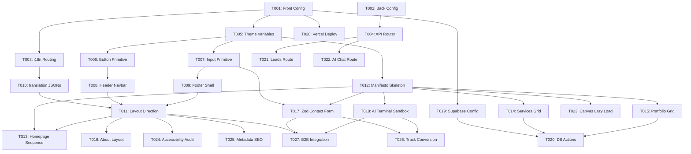

# Tasks: Aivora Platform MVP

**Input**: Design documents from `/specs/001-aivora-platform-mvp/`
**Prerequisites**: plan.md, spec.md, research.md, data-model.md, contracts/

---

## Phase 0 — Project Foundation
**Goal**: Configure clean base settings for Next.js frontend and FastAPI backend.

- [x] T001 Configure frontend compiler and linter in frontend/package.json
  - **Title**: Initialize Frontend Configuration
  - **Objective**: Configure dependencies, strict TypeScript linting, and compiler parameters.
  - **Dependencies**: None
  - **Complexity**: S
  - **Acceptance Criteria**: Project compiles and CLI shows no warning indicators.
  - **Validation Steps**: Run `npm install` and verify `tsconfig.json` contains `"strict": true`.
  - **Expected Deliverables**: `frontend/package.json`, `frontend/tsconfig.json`, `frontend/eslint.config.js`.

- [x] T002 [P] Configure backend environment lockfiles in backend/requirements.txt
  - **Title**: Initialize Backend Configuration
  - **Objective**: Set up Python 3.12 requirements for FastAPI, Uvicorn, Pydantic v2, and slowapi.
  - **Dependencies**: None
  - **Complexity**: S
  - **Acceptance Criteria**: Virtual environment installs dependencies without version conflicts.
  - **Validation Steps**: Run `pip install -r requirements.txt`.
  - **Expected Deliverables**: `backend/requirements.txt`, `backend/Dockerfile`.

---

## Phase 1 — Core Architecture
**Goal**: Implement dynamic locales and router hierarchies.

- [x] T003 Set up locale routing parameters in frontend/src/middleware.ts
  - **Title**: Configure Locale Routing Middleware
  - **Objective**: Bind Next.js middleware to parse English/Arabic locales and rewrite request URLs.
  - **Dependencies**: T001
  - **Complexity**: M
  - **Acceptance Criteria**: Accessing root domain redirects automatically to active locale defaults.
  - **Validation Steps**: Open browser to `http://localhost:3000/` and verify redirect to `/en`.
  - **Expected Deliverables**: `frontend/src/middleware.ts`.

- [x] T004 [P] Establish backend router structure in backend/app/api/v1/router.py
  - **Title**: Initialize API Router Paths
  - **Objective**: Configure FastAPI router endpoints for AI completions and validation leads.
  - **Dependencies**: T002
  - **Complexity**: S
  - **Acceptance Criteria**: Requesting API swagger schema displays all endpoint categories.
  - **Validation Steps**: Run backend server and verify `http://localhost:8000/docs`.
  - **Expected Deliverables**: `backend/app/main.py`, `backend/app/api/v1/router.py`.

---

## Phase 2 — Design System Integration
**Goal**: Map all visual design system tokens to stylesheet variables.

- [x] T005 [P] Implement design system token configs in frontend/src/styles/globals.css
  - **Title**: Setup Tailwind v4 Theme Variables
  - **Objective**: Load variables for primary colors, serif display fonts, and standard elevation shadows.
  - **Dependencies**: T001
  - **Complexity**: M
  - **Acceptance Criteria**: Custom token directives compile correctly.
  - **Validation Steps**: Verify Tailwind styles build without errors.
  - **Expected Deliverables**: `frontend/src/styles/globals.css`, `frontend/tailwind.config.ts`.

- [x] T006 [P] Create button UI primitive in frontend/src/components/ui/Button.tsx
  - **Title**: Extract Reusable Button Component
  - **Objective**: Write type-safe standard button matching component UI contracts.
  - **Dependencies**: T005
  - **Complexity**: S
  - **Acceptance Criteria**: Component allows variants (`primary`, `secondary`) and fits design limits.
  - **Validation Steps**: Run compiler tests verifying props interface types.
  - **Expected Deliverables**: `frontend/src/components/ui/Button.tsx`.

- [x] T007 [P] Create input UI primitive in frontend/src/components/ui/Input.tsx
  - **Title**: Extract Reusable Input Field Component
  - **Objective**: Write label and error states matching input field contract specs.
  - **Dependencies**: T005
  - **Complexity**: S
  - **Acceptance Criteria**: Form displays custom label and red validation borders on error state.
  - **Validation Steps**: Verify visual border changes when error prop is loaded.
  - **Expected Deliverables**: `frontend/src/components/ui/Input.tsx`.

---

## Phase 3 — Application Shell
**Goal**: Build global layout shell boundaries.

- [x] T008 Configure application shell header in frontend/src/components/layout/Navbar.tsx
  - **Title**: Build Navigation Header Shell
  - **Objective**: Write sticky layout navigation header with language selector triggers.
  - **Dependencies**: T006
  - **Complexity**: M
  - **Acceptance Criteria**: Navigation links behave correctly across screen sizes.
  - **Validation Steps**: Test mobile header viewport scaling under 768px.
  - **Expected Deliverables**: `frontend/src/components/layout/Navbar.tsx`.

- [x] T009 [P] Configure application shell footer in frontend/src/components/layout/Footer.tsx
  - **Title**: Build Footer Shell
  - **Objective**: Write sitemap link rows and newsletter form placeholders.
  - **Dependencies**: T007
  - **Complexity**: S
  - **Acceptance Criteria**: Footer layouts align correctly.
  - **Validation Steps**: Open the preview page and check mobile layouts.
  - **Expected Deliverables**: `frontend/src/components/layout/Footer.tsx`.

---

## Phase 4 — Internationalization (i18n)
**Goal**: Bind locale JSON translation maps.

- [x] T010 [P] [US2] Create translation maps in frontend/messages/en.json
  - **Title**: Configure English Dictionary
  - **Objective**: Save translation variables for static text headers and form descriptions.
  - **Dependencies**: T003
  - **Complexity**: S
  - **Acceptance Criteria**: Dictionary key maps match localized route requests.
  - **Validation Steps**: Validate JSON format is valid.
  - **Expected Deliverables**: `frontend/messages/en.json`, `frontend/messages/ar.json`.

- [x] T011 [US2] Bind document layouts to direction state in frontend/src/app/[locale]/layout.tsx
  - **Title**: Set Document Layout Locale Direction
  - **Objective**: Render HTML elements with proper `dir` attribute (LTR/RTL) based on target route parameters.
  - **Dependencies**: T010, T008, T009
  - **Complexity**: M
  - **Acceptance Criteria**: `/ar` page renders with `dir="rtl"` and RTL stylesheet logical variables.
  - **Validation Steps**: Toggle language switcher and verify document direction in developer tools.
  - **Expected Deliverables**: `frontend/src/app/[locale]/layout.tsx`.

---

## Phase 5 — Homepage Narrative
**Goal**: Scaffold the narrative sections of the homepage.

- [x] T012 [P] Construct narrative skeleton files in frontend/src/components/sections/manifesto.tsx
  - **Title**: Scaffold Section Placeholders
  - **Objective**: Create placeholder components for the 25 homepage story sections.
  - **Dependencies**: T005
  - **Complexity**: L
  - **Acceptance Criteria**: All 25 sections exist as buildable components.
  - **Validation Steps**: Compile site and verify zero imports resolve errors.
  - **Expected Deliverables**: 25 components in `frontend/src/components/sections/`.

- [x] T013 Setup narrative homepage layout wrapper in frontend/src/app/[locale]/page.tsx
  - **Title**: Configure Homepage Page Entry
  - **Objective**: Import and sequence all 25 sections matching sitemap specification flows.
  - **Dependencies**: T012, T011
  - **Complexity**: M
  - **Acceptance Criteria**: Page loads all placeholder elements in correct sequence.
  - **Validation Steps**: Inspect visual flows matching spec.
  - **Expected Deliverables**: `frontend/src/app/[locale]/page.tsx`.

---

## Phase 6 — Services
**Goal**: Implement services grid displays.

- [ ] T014 [US3] Create services card grid in frontend/src/components/sections/services-grid.tsx
  - **Title**: Render Services Section Grid
  - **Objective**: Display services in a responsive grid of card components.
  - **Dependencies**: T012
  - **Complexity**: M
  - **Acceptance Criteria**: Services load correctly and scale responsively.
  - **Validation Steps**: Audit grid display on mobile widths (320px).
  - **Expected Deliverables**: `frontend/src/components/sections/services-grid.tsx`.

---

## Phase 7 — Case Studies
**Goal**: Implement case study filters.

- [ ] T015 [US3] Create portfolio card layout in frontend/src/components/sections/case-studies-grid.tsx
  - **Title**: Render Case Studies Grid
  - **Objective**: Render masonry layout showing past work with technology filter buttons.
  - **Dependencies**: T012
  - **Complexity**: M
  - **Acceptance Criteria**: Grid filters dynamically as tags are toggled.
  - **Validation Steps**: Verify only matching projects remain on tag selection.
  - **Expected Deliverables**: `frontend/src/components/sections/case-studies-grid.tsx`.

---

## Phase 8 — About
**Goal**: Render narrative About descriptions.

- [ ] T016 Build about section details in frontend/src/app/[locale]/about/page.tsx
  - **Title**: Render About Page
  - **Objective**: Render About section using serif fonts and asymmetric typography layouts.
  - **Dependencies**: T011
  - **Complexity**: S
  - **Acceptance Criteria**: Content layouts look correct.
  - **Validation Steps**: Review typography alignments.
  - **Expected Deliverables**: `frontend/src/app/[locale]/about/page.tsx`.

---

## Phase 9 — Contact
**Goal**: Build contact intake form.

- [ ] T017 [US1] Create form schema validation logic in frontend/src/components/sections/contact-form.tsx
  - **Title**: Render Contact Portal Form
  - **Objective**: Build lead intake form validating input data using Zod.
  - **Dependencies**: T007, T012
  - **Complexity**: M
  - **Acceptance Criteria**: Submissions block and show validation errors on incorrect email formats.
  - **Validation Steps**: Input invalid parameters and verify error messages render.
  - **Expected Deliverables**: `frontend/src/components/sections/contact-form.tsx`.

---

## Phase 10 — AI Showcase
**Goal**: Implement AI terminal client UI.

- [ ] T018 [US1] Build terminal interface element in frontend/src/components/sections/ai-terminal.tsx
  - **Title**: Render AI Interactive Sandbox
  - **Objective**: Build terminal input client streaming API response loops.
  - **Dependencies**: T012
  - **Complexity**: L
  - **Acceptance Criteria**: Chat terminal receives user messages and logs query outputs.
  - **Validation Steps**: Mock API stream completions and confirm character outputs print.
  - **Expected Deliverables**: `frontend/src/components/sections/ai-terminal.tsx`.

---

## Phase 11 — CMS
**Goal**: Connect Supabase client integration.

- [ ] T019 Integrate Supabase client client configuration in frontend/src/lib/supabase.ts
  - **Title**: Setup Supabase Connection Client
  - **Objective**: Configure Supabase client instances using environment config tokens.
  - **Dependencies**: T001
  - **Complexity**: S
  - **Acceptance Criteria**: Client instance connects and queries database rows.
  - **Validation Steps**: Execute test DB fetch check.
  - **Expected Deliverables**: `frontend/src/lib/supabase.ts`.

- [ ] T020 Bind database feeds to services and case studies in frontend/src/lib/actions.ts
  - **Title**: Implement Server Actions
  - **Objective**: Write functions querying Services and CaseStudies entries from PostgreSQL database.
  - **Dependencies**: T019, T014, T015
  - **Complexity**: M
  - **Acceptance Criteria**: Services and CaseStudies pages render dynamic content directly from DB.
  - **Validation Steps**: Add mock data in Supabase Studio and confirm it updates on page reload.
  - **Expected Deliverables**: `frontend/src/lib/actions.ts`.

---

## Phase 12 — Backend
**Goal**: Configure FastAPI endpoints and prompt middleware.

- [x] T021 Configure lead intake endpoint in backend/app/api/v1/endpoints/leads.py
  - **Title**: Setup Backend Leads Route
  - **Objective**: Validate contact form data payload using Pydantic models.
  - **Dependencies**: T004
  - **Complexity**: S
  - **Acceptance Criteria**: Correct requests receive `201` created codes and save to database.
  - **Validation Steps**: Send valid POST requests via swagger docs.
  - **Expected Deliverables**: `backend/app/api/v1/endpoints/leads.py`, `backend/app/schemas/schema.py`.

- [x] T022 Implement backend AI chat completion service in backend/app/services/ai_service.py
  - **Title**: Setup AI Completion Route
  - **Objective**: Setup prompt parameters and stream OpenAI completion outputs.
  - **Dependencies**: T004
  - **Complexity**: L
  - **Acceptance Criteria**: Service executes queries and filters prompt injections.
  - **Validation Steps**: Send valid test chat prompts and verify streaming tokens.
  - **Expected Deliverables**: `backend/app/services/ai_service.py`, `backend/app/api/v1/endpoints/ai.py`, `backend/app/core/prompts.py`.

---

## Phase 13 — Performance
**Goal**: Apply optimization scripts.

- [x] T023 Setup canvas dynamic loading scripts in frontend/src/components/sections/hero-3d.tsx
  - **Title**: Configure R3F Canvas Lazy Loading
  - **Objective**: Defer loading R3F and GSAP modules until scroll entry viewport markers are hit.
  - **Dependencies**: T012
  - **Complexity**: M
  - **Acceptance Criteria**: Page loads cleanly; Lighthouse yields performance metrics above 95.
  - **Validation Steps**: Run bundle audits verifying R3F is code-split.
  - **Expected Deliverables**: `frontend/src/components/sections/hero-3d.tsx`.

---

## Phase 14 — Accessibility
**Goal**: Verify keyboard navigation and semantic HTML layers.

- [x] T024 Perform accessibility validation overrides in frontend/tests/accessibility/axe.test.ts
  - **Title**: Build Accessibility Verification Pipeline
  - **Objective**: Configure automated axe-core test runners to verify WCAG AA standards.
  - **Dependencies**: T011
  - **Complexity**: M
  - **Acceptance Criteria**: Automated test suites yield 0 violations.
  - **Validation Steps**: Execute test runner packages.
  - **Expected Deliverables**: `frontend/tests/accessibility/axe.test.ts`.

---

## Phase 15 — SEO
**Goal**: Bind dynamic meta tags.

- [ ] T025 Setup dynamic metadata hooks in frontend/src/app/[locale]/[slug]/page.tsx
  - **Title**: Implement Metadata Tags
  - **Objective**: Build metadata output models generating localized page titles and descriptions.
  - **Dependencies**: T011
  - **Complexity**: S
  - **Acceptance Criteria**: Header contains correct title tags matching route params.
  - **Validation Steps**: Verify page metadata headers.
  - **Expected Deliverables**: `frontend/src/app/[locale]/services/[slug]/page.tsx`, `frontend/src/app/[locale]/case-studies/[slug]/page.tsx`.

---

## Phase 16 — Analytics
**Goal**: Connect event tracking scripts.

- [ ] T026 Build conversion tracking hooks in frontend/src/lib/analytics.ts
  - **Title**: Configure Conversion Tracking
  - **Objective**: Setup event tracking hooks firing on chatbot interaction and form submission events.
  - **Dependencies**: T017, T018
  - **Complexity**: S
  - **Acceptance Criteria**: Verification events trigger correctly.
  - **Validation Steps**: Trigger form submit action and confirm events fire.
  - **Expected Deliverables**: `frontend/src/lib/analytics.ts`.

---

## Phase 17 — Testing
**Goal**: Run end-to-end integration verifications.

- [ ] T027 Complete end-to-end layout tests in frontend/tests/integration/navigation.spec.ts
  - **Title**: Build Integration Tests
  - **Objective**: Validate form submission flows and language switcher routing.
  - **Dependencies**: T011, T017, T018
  - **Complexity**: M
  - **Acceptance Criteria**: Integration tests pass successfully.
  - **Validation Steps**: Execute test runner tools.
  - **Expected Deliverables**: `frontend/tests/integration/navigation.spec.ts`.

---

## Phase 18 — Deployment
**Goal**: Deliver production configurations.

- [ ] T028 Deliver Vercel configuration properties in frontend/vercel.json
  - **Title**: Configure Vercel Build Properties
  - **Objective**: Verify security headers and route rewrites match staging guidelines.
  - **Dependencies**: T001
  - **Complexity**: S
  - **Acceptance Criteria**: Build succeeds in Vercel preview logs.
  - **Validation Steps**: Trigger git push triggers and inspect build status.
  - **Expected Deliverables**: `frontend/vercel.json`.

---

## Dependencies & Execution Order



## Parallel Execution Examples

### Launching Front/Back Configuration Setup
```bash
# Developer A:
Task: "Configure frontend compiler and linter in frontend/package.json"

# Developer B:
Task: "Configure backend environment lockfiles in backend/requirements.txt"
```

### Launching Primitive Components
```bash
# Developer A:
Task: "Create button UI primitive in frontend/src/components/ui/Button.tsx"

# Developer B:
Task: "Create input UI primitive in frontend/src/components/ui/Input.tsx"
```

## Implementation Strategy

### MVP First (User Story 1 Focus)
1. Complete Project Foundation (Phase 0) & Core Architecture (Phase 1)
2. Complete Design System Integration (Phase 2) & Application Shell (Phase 3)
3. Implement Zod Contact Form (T017) & AI Terminal Sandbox (T018)
4. Setup Backend API routing and validation endpoint logic (T021, T022)
5. Verify lead submission flows locally before executing additional narrative phases.
